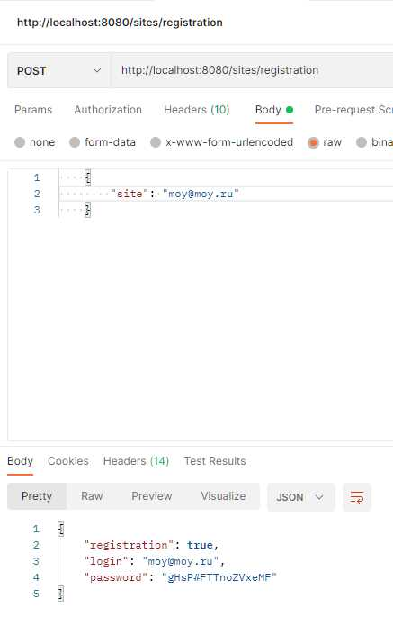
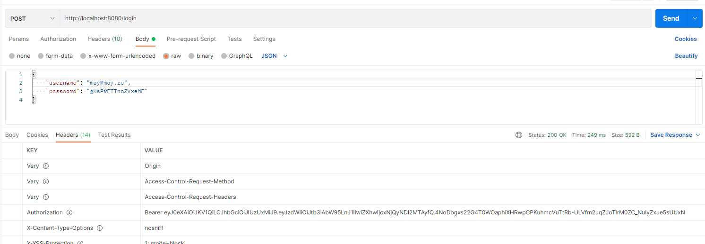
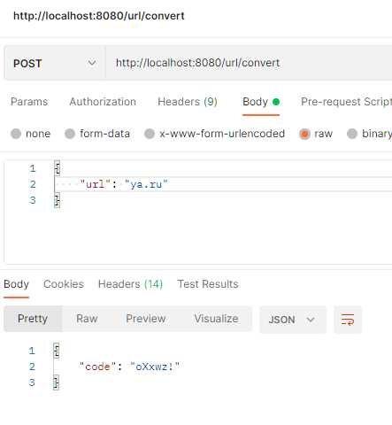
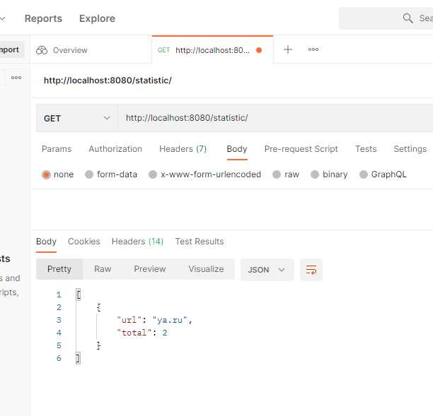

UrlShortcut
====================================================
Project: Short URL generation service.
----------------------------------------------------
Account registration is available. After registration, it is possible
to save accordance of full URL to a short link. 
You do not need authorization on the site to redirect to the full address.
The project uses Spring boot, JWT authorization, Hibernate.

Configuration
----------------------------------------------------
The project should configured the Spring Boot.

Usage
----------------------------------------------------
Сервисом могут пользоваться разные сайты. Каждому сайту выдается пару пароль и логин.
Чтобы зарегистрировать сайт в систему нужно отправить запрос.
- 1.Registration.
- req. POST /registration 
body: {
       "site" : "site.ru"
       }
- resp.
body: {
       "registration" : true/false, 
       "login": "site.ru",
       "password" : "Password"
       }
- 2.Authorisation.
POST /login
body: {
       "username" : "site.ru",
       "password" : "Password"       
       }
- 3.URL registration.
POST /convert
body: {
       "url" : "http://fullxxxxxxxxxxxxxxxxxxx.ru"
       }
resp.
body: {
       "code" : "http://short"
       }
- 4.Redirect.
Get /redirect/ShortUrl
- 5.Statistics.
GET /statistic

Docker
----------------------------------------------------
There is a docker-compose.yml file in the root of the project. Go to the root of the project, 
then run the command "docker-compose up".